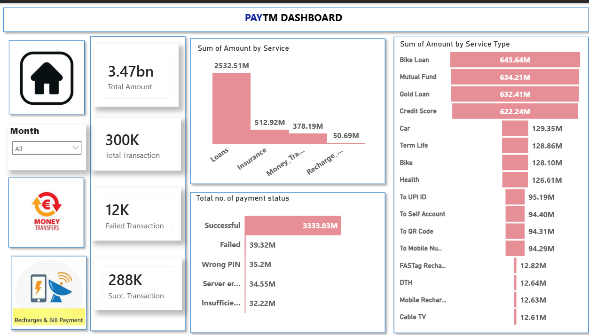
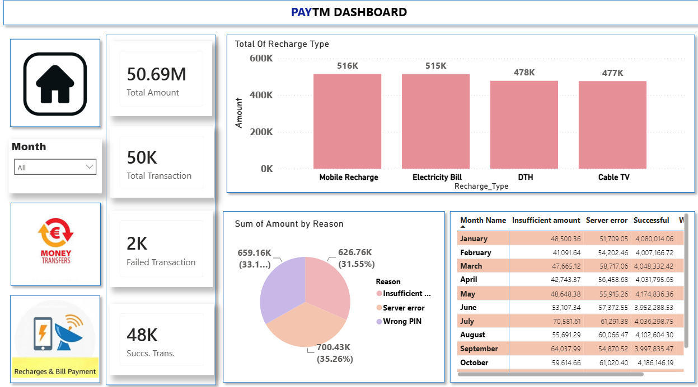
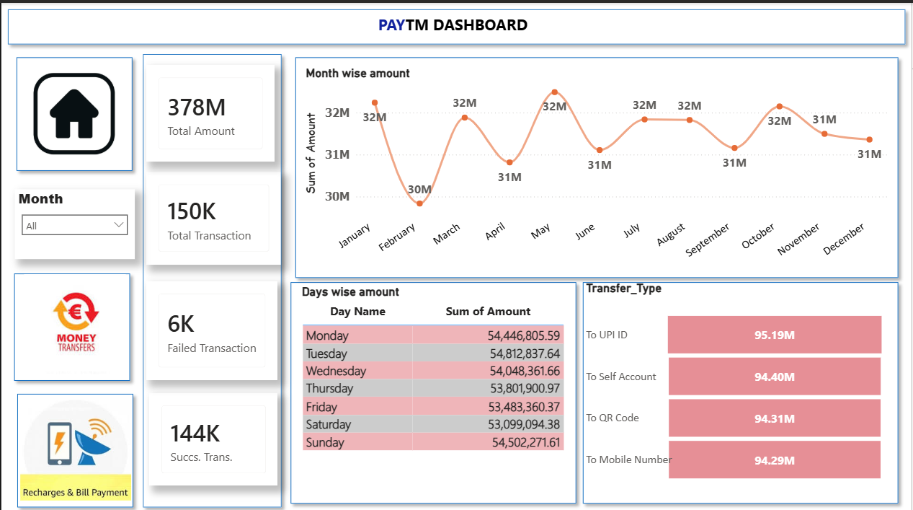

# Paytm Transaction Analytics Dashboard — Power BI

Interactive 3-page Power BI dashboard analyzing **300K+ Paytm transactions** worth **₹3.47 Billion** across digital payment services, recharge activities, transfer methods, and payment status.

## Dashboard Preview

## Business Problem

Digital payment platforms need a centralized dashboard to monitor transaction performance, identify high-value services, track payment success rates, and analyze customer payment behavior. This dashboard enables stakeholders to monitor business KPIs, detect transaction failures, optimize digital payment services, and support data-driven decision-making.

## Tools Used

- Power BI Desktop — Dashboard Development
- Power Query — Data Cleaning & Transformation
- DAX — KPI Measures & Calculations
- Dataset: Paytm Transaction Dataset

## Dashboard Highlights

### Page 1 — Service Performance
- Total Transaction Value: **₹3.47 Billion**
- Total Transactions: **300K**
- Successful Transactions: **288K**
- Failed Transactions: **12K**
- Loans generated the highest transaction value (**₹2.53 Billion**).
- Bike Loan, Mutual Fund, Gold Loan, and Credit Score were the top-performing service types.
- Payment status analysis highlighted Successful, Failed, Wrong PIN, Server Error, and Insufficient Balance transactions.

### Page 2 — Recharge & Payment Analysis
- Recharge transaction value reached **₹50.69 Million**.
- Mobile Recharge and Electricity Bill recorded the highest transaction volume.
- Failure analysis identified **Insufficient Balance**, **Server Error**, and **Wrong PIN** as the leading causes of unsuccessful payments.
- Monthly performance table enabled comparison of payment status across different months.

### Page 3 — Transaction Trends
- Monthly transaction value remained consistent between **₹30M–₹32M**.
- Daily transaction analysis showed balanced payment activity throughout the week.
- UPI ID was the most frequently used transfer method, followed by Self Account, QR Code, and Mobile Number.

## Features

- Interactive Month slicer
- Multi-page dashboard navigation
- KPI Cards
- Dynamic cross-filtering
- DAX-based calculations
- Service-wise and Transfer-wise analysis
- Payment failure analysis
- Monthly and daily trend analysis

## Business Insights

- Loans contributed the largest share of transaction value.
- UPI remained the preferred digital payment method.
- Most payment failures were caused by Insufficient Balance and Server Errors.
- Recharge services maintained consistent demand throughout the year.
- Stable monthly transaction values indicate steady customer engagement.

## Business Recommendations

- Prioritize investment in high-performing loan services.
- Improve server stability to reduce failed transactions.
- Introduce cashback offers for lower-performing recharge services.
- Optimize the UPI payment experience to maintain customer satisfaction.
- Continuously monitor payment failure trends to improve transaction success rates.

